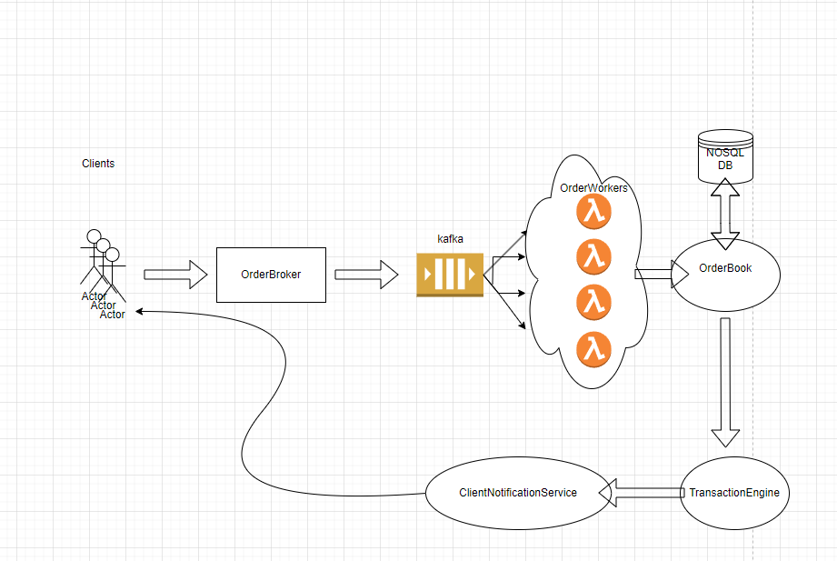

Given the simple implemenmtation of OrderBook and its use cases, for a real world, scaling architecture, I would consider a few aspects:
1. Have one (or multiple) order matching engines.  This engine processes incoming buy and sell orders, matches them based on predefined rules, and updates the order book accordingly.
   To handle a large volume of requests in parallel, the order matching engine can be designed as a multithreaded or event-driven system.
   Multithreading allows the engine to process multiple orders concurrently, while an event-driven architecture leverages asynchronous processing to handle requests without blocking.
   Consider running some performance tests and figure out if a single multi-threaded component or multiple horizontally scaled services are the better approach. I would start off with Lambda.
2. For persistence, I would go for Couchbase Capella (or MongoDB) to ensure scalability and performance.
3. Obviously, decoupling is necessary, so a message queue component is a must. We can buffer incoming requests here and also ensure we have reliable message delivery and keep good order of event processing.
4. Have a TransactionEngine in place when there is a crossing between ask and sell price to resolve OrderBook entries.
5. Have a ClientNotificationService to inform clients of the successful transactions.

